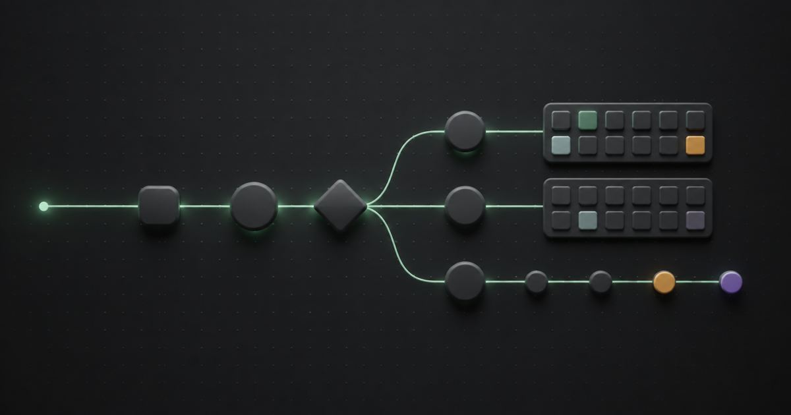
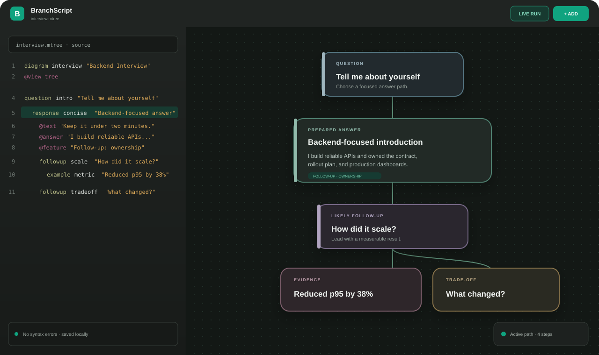
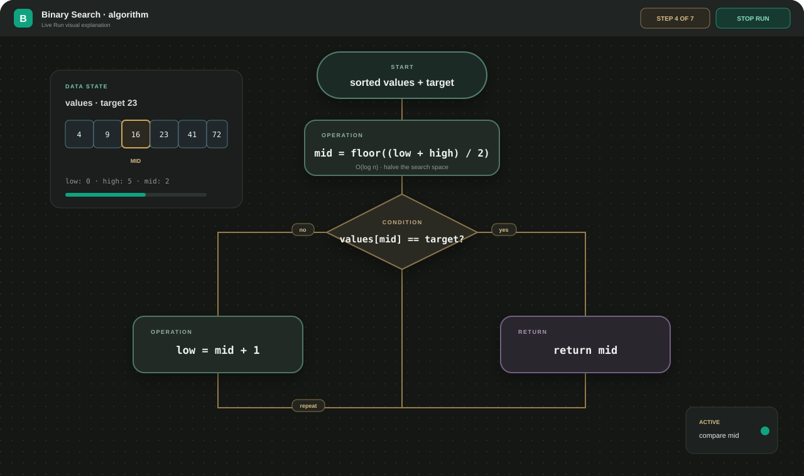

# BranchScript — Visual Product Guide

BranchScript turns a small, readable `.mtree` script into an interactive canvas. It is built for people who want to see possible questions, answers, follow-ups, decisions, algorithms, and data structures without losing the clarity of plain text.

[Open the live application](https://branchscript.neuralithaistudio.com/app/) · [Read the language reference](language.md) · [View the architecture](architecture.md)



> All examples in this guide are synthetic and product-neutral. No user-imported interview material is included in the repository.

## What BranchScript does

Write a document on the left and explore the generated map on the right. Both representations describe the same graph, so editing the source, adding a visual box, or moving a node keeps one coherent project.

```text
Readable .mtree source
        ↓
Typed compiler and diagnostics
        ↓
Interactive canvas
        ↓
Live Run, local save, cloud save, or export
```

The workspace includes:

- A syntax-aware CodeMirror editor with diagnostics and undo/redo
- An infinite canvas with pan, adaptive zoom, minimap, search, and automatic layout
- A visual builder for people who prefer not to write source directly
- Drag-and-drop shapes on desktop and touch placement on mobile
- Double-click editing for existing boxes
- Local persistence without an account and private cloud saving after sign-in
- `.mtree` source export and complete project export

## Interview preparation as a navigable map

The Tree view is useful when a conversation can move through several possible answers and follow-ups. A short title remains visible on the canvas, while `@text`, `@answer`, and `@feature` keep the material needed during practice.



```mtree
diagram interview_practice "Interview Practice"
@view tree

topic opening "Opening"
  @category "Opening"
  @width compact
  question introduction "Tell me about yourself"
    @category "Opening"
    response concise "Concise introduction"
      @category "Prepared answer"
      @width wide
      @answer "Present your role, strongest evidence, and motivation."
      @feature "Keep the answer under two minutes"
    followup ownership "What did you own?"
      @category "Follow-up"
```

### Visual categorization

`@category` assigns a deterministic color and a visible category badge. Nodes in the same category keep the same color across the diagram. Explicit `@color` remains available when a manual override is needed.

Use a small category vocabulary for quick scanning:

| Category | Typical content | Suggested width |
| --- | --- | --- |
| Opening | Introductions and first questions | `compact` or `normal` |
| Role fit | Motivation and product interest | `normal` |
| Behavioral | STAR stories and ownership evidence | `wide` |
| Technical | Architecture, Android, algorithms, or debugging | `wide` |
| Company knowledge | Product and engineering research | `normal` |
| Closing | Questions for the interviewer and final notes | `compact` |

Keep detailed keywords in `@tag`; too many visible categories make a map harder to scan.

## Six visual languages

The same readable source format supports six purpose-built views.

| View | Best for | Visual behavior |
| --- | --- | --- |
| **Tree** | Interview branches, brainstorming, possible follow-ups | Parent-to-child branching |
| **Flow** | Processes, preparation sequences, named transitions | Directed steps and decisions |
| **Neural** | Inputs, signals, layers, and outputs | Layered activation map |
| **Logic** | Conditions, rules, yes/no paths | Decision-focused branching |
| **Algorithm** | Functions, loops, operations, and returns | Runnable pseudocode path |
| **Data** | Arrays, stacks, queues, lists, records, and pointers | Structure-specific cells and references |

System Design is shown in the interface as a future visual language and remains disabled until its script model is ready.

## Algorithms that can be stepped through

Algorithm view gives operations, conditions, loops, and return values distinct shapes. Live Run highlights the active node and connection, making control flow easier to explain during practice or teaching.



```mtree
diagram binary_search "Binary Search"
@view algorithm

start begin "sorted values and target"
operation midpoint "mid = floor((low + high) / 2)"
condition found "values[mid] == target?"
operation continue "shrink the search range"
return done "return mid"

connect begin -> midpoint
connect midpoint -> found
connect found -> done "yes"
connect found -> continue "no"
connect continue -> midpoint "repeat"
```

## Build visually or write the script

Both workflows produce the same `.mtree` source.

### Script-first

1. Choose a view with `@view`.
2. Declare nodes with readable IDs and short labels.
3. Add supporting attributes such as `@category`, `@answer`, and `@width`.
4. Connect named nodes or indent Tree children.
5. Use diagnostics to correct incomplete declarations.

### Visual-first

1. Select **Add** to open the visual builder.
2. Drag a card, pill, diamond, or circle onto the desktop canvas.
3. On touch devices, drag a shape or select it and tap the canvas.
4. Double-click or double-tap a node to edit its text and presentation.
5. Connect boxes from the builder; BranchScript writes the declarations back to the source.

## Readability controls

BranchScript keeps map structure visible at a distance while retaining detailed content when zoomed in.

```mtree
text section_title "Technical discussion"
  @category "Guide"
  @font serif
  @font-size 28
  @font-weight bold
  @align center
  @width wide

response architecture "Architecture decision"
  @category "Technical"
  @width wide
  @answer "State the constraint, alternatives, trade-off, and measured outcome."
```

Useful presentation attributes:

- `@width compact|normal|wide` controls wrapping and card density.
- `@font sans|serif|mono` separates headings, prose, and technical notation.
- `@font-size`, `@font-weight`, and `@align` format text blocks.
- `@status idea|active|done|blocked` shows practice or workflow state.
- `@priority high` emphasizes the most important paths.
- Light theme uses pale, translucent category surfaces instead of dark cards.

## Search and navigation

Search matches IDs, labels, prepared answers, supporting text, features, tags, and categories. Press **Enter** to focus the first match and continue pressing **Enter** to cycle forward. **Shift+Enter** moves backward.

Canvas navigation includes:

- Mouse-wheel and trackpad zoom centered on the pointer
- `Ctrl`/`Command` + wheel zoom
- Faster adaptive zoom when the current scale is very small
- One-finger mobile pan and two-finger pinch zoom
- Double-click focus and edit
- Fit View, automatic layout, minimap, and full-screen canvas

## Live Run

Live Run turns a static diagram into a rehearsal path. Each visual language has a different motion treatment:

- Tree branches reveal the next conversational option.
- Flow advances through named transitions.
- Neural nodes pulse as activation moves through layers.
- Logic flashes the selected decision branch.
- Algorithm scans operations in discrete steps.
- Data animates the active cells and references.

Reset returns the runner to its initial state, while Stop Run ends the active session.

## Privacy and project storage

- Editing and local saving work without an account.
- Local projects are stored in the browser with IndexedDB.
- Cloud saving requires a verified BranchScript account.
- The public frontend never receives database credentials or JWT private keys.
- Imported `.mtree` files are parsed as data and are never executed as JavaScript.
- Exported project bundles include source and workspace positions, making them portable between devices.

## Run locally

```bash
npm install
npm run dev
```

Open `http://127.0.0.1:5173/app/`.

Production checks:

```bash
npm run check
```

Container build:

```bash
docker network inspect neuralith-shared >/dev/null 2>&1 || docker network create neuralith-shared
docker compose up -d --build
```

## Continue exploring

- [`.mtree` language reference](language.md)
- [Application architecture](architecture.md)
- [Security policy](../SECURITY.md)
- [Contribution guide](../CONTRIBUTING.md)
- [Live BranchScript playground](https://branchscript.neuralithaistudio.com/app/)
